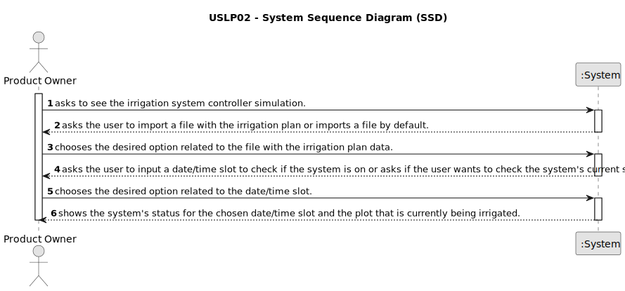

# USLP02 - As Product Owner, I want a functionality that consists on simulating an irrigation system controller

## 1. Requirements Engineering

### 1.1. User Story Description

As Product Owner, I want a functionality that consists on simulating an irrigation system controller.

### 1.2. Customer Specifications and Clarifications

**From the specifications document:**

> A text file with a set of instructions must be consumed, generating an irrigation plan valid for 30 days.
> 
> The file contains the following information and format:
> 
> Irrigation hours: This line defines the times at which an irrigation cycle begins,
for example: 8:30 and 17:00; this means that there are two daily watering cycles that
start at 8:30 and 17:00, respectively.
> 
> Sector, Duration, Regularity: There is a line for each sector to be irrigated. 
Sector (one or more plots) identifies the area to be irrigated (controlled by a
solenoid valve);
Duration, the time in minutes that the sector must receive irrigation;
Regularity, the recurrence formula that defines the days the sector must be
watered: T, all; I, odd, P, even, 3, every 3 days.
> 
> Example:
> 8:30, 17:00
A,14,T
B,8,T
C,25,P
D,25,I
E,7,T
F,10,3
> 
> For capacity reasons, the sectors are watered sequentially.
The need to water on even or odd days results from the need to balance the irrigation needs of
all sectors depending on maximum capacity of the system.
> 
> The irrigation controller contains an irrigation plan for 30 days from the date
of creation and at any time (date/time) knows how to respond whether if it is watering or
not, and, if so, which sector is watering and how many minutes left to finish.

**From the client clarifications:**

> 2023/10/14
> 
> **Question 1:** When we create a watering plan for the next 30 days, the program must be able to respond in the next 30 days whether it is watering or not according to the day, hour and minute we ask?
Or do we create the irrigation plan and ask if it is watering on a specific day and time, entered by the user in the same project execution?
>
> **Answer 1:** The Plan must know how to respond, to an entered date/time, the corresponding state;
it could be a good idea, if no date/time was inserted, to assume by default the current date/time.

> 2023/10/18
> 
> **Question 2:** In USLP02, the statement states that the regularity with which a plot is watered can vary between values: {every, odd, even, every 3 days}.
The question lies in the classification of odd and even days.
I don't understand if a day is considered odd if the day of the month is odd or if the day since the plan started is odd. Using examples, is August 3rd considered an odd day or is the third day of the plan considered odd?
> 
> **Answer 2:** You should consider calendar days. October 1st is odd, December 12th is even.

> 2023/10/19
> 
> **Question 3:** In USLP02, it asks to be able to import a file in order to create an irrigation plan. Our question is based on the possibility of more than one plan being active. 
Would the customer like it to be possible to have more than one plan within the program or to have just one and every time a new file was imported the old one was changed?
>
> **Answer 3:** You should assume that there is only one watering plan.

> 2023/10/22
> 
> **Question 4:** Can you clarify the desired extensions in a file that reflects an irrigation plan?
This file can be .txt, .csv, etc..., or is there a specific one?
> 
> **Answer 4:** The file to be consumed with watering instructions may have a .txt extension.
If a text file (desirable) is generated with the generation result (Irrigation Plan), it should have a .csv extension.

> 2023/10/24
>
> **Question 5:** In a question asked about the extension of the irrigation plan, the client said the following: "If you generate a text file (desirable) with the result of the generation (Irrigation Plan), it should have a .csv extension.".
Can the client elaborate further on this 'result' of generating the Irrigation Plan? What it is?
>
> **Answer 5:** Let's assume the following example file with instructions for generating the irrigation plan:
8:30, 17:00
A,14,T
B,8,T
C,25,P
D,25,I
E,7,T
F,10.3
and that the generation day would be today (2023/10/24). Therefore, the irrigation plan should be:
Day Sector Duration Start End
10/24/2023 TO 14 08:30 08:44
10/24/2023 B 8 08:44 08:52
10/24/2023 C 25 08:52 09:17
10/24/2023 E 7 09:17 09:24
10/24/2023 F 10 09:24 09:34
10/24/2023 TO 14 17:00 17:14
10/24/2023 B 8 17:14 17:22
10/24/2023 C 25 17:22 17:47
10/24/2023 E 7 17:47 17:54
10/24/2023 F 10 17:54 18:04
If you export this result to a file, .csv seems like an appropriate extension.

### 1.3. Acceptance Criteria

* **AC1:** The file with the irrigation plan data can't have negative duration values.
* **AC2:** The file with the irrigation plan data can't have regularity values different from "T", "P", "I" or "3".

### 1.4. Found out Dependencies

* There exists no dependencies related to other user stories.

### 1.5 Input and Output Data

**Input Data:**

* Typed data:
  * .txt file with the irrigation plan data (if the client wants to).
  * Date/time slot (if the client wants to).

**Output Data:**

* The system's status for the desired date/time slot.

### 1.6. System Sequence Diagram (SSD)

**Other alternatives might exist.**

