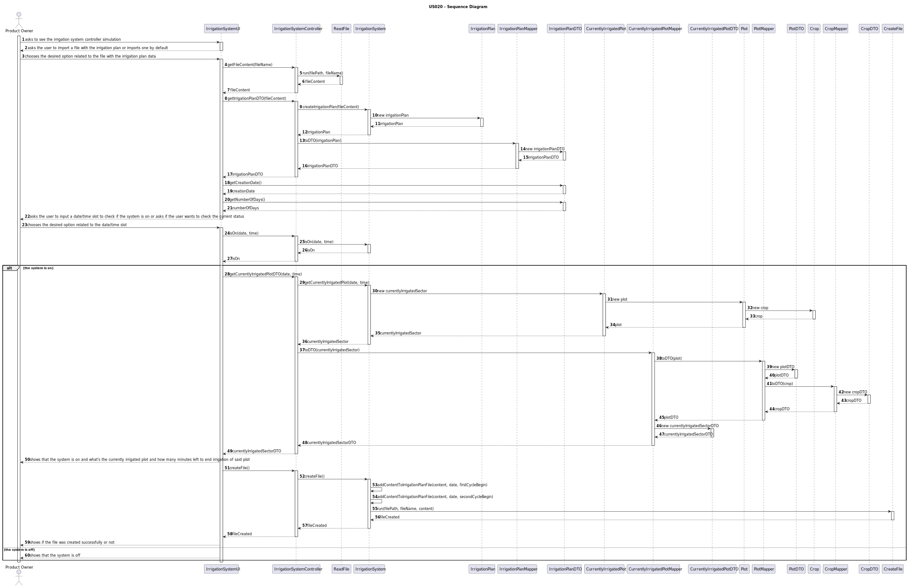
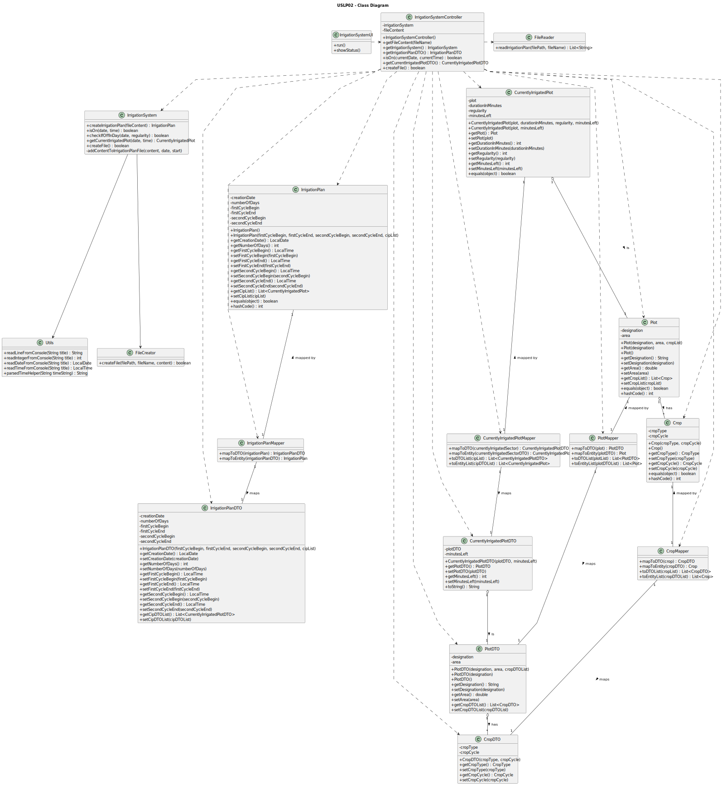

# USLP02 - As Product Owner, I want a functionality that consists on simulating an irrigation system controller

## 3. Design - User Story Realization 

### 3.1. Rationale

| Interaction ID                                                                                                                              | Question: Which class is responsible for...                                           | Answer                     | Justification (with patterns)                                                                                                                                 |
|:--------------------------------------------------------------------------------------------------------------------------------------------|:--------------------------------------------------------------------------------------|:---------------------------|:--------------------------------------------------------------------------------------------------------------------------------------------------------------|
| Step 1: asks to see the irrigation system controller simulation                                                                             | ... interacting with the user?                                                        | IrrigationSystemUI         | Pure Fabrication: there is no reason to assign this responsibility to any existing class in the Domain Model.                                                 |
|                                                                                                                                             | ... coordinating the US?                                                              | IrrigationSystemController | Controller: this class is responsible for coordinating and distributing the actions perfomed on the UI to the domain layer.                                   |
| Step 2: asks the user to import a file with the irrigation plan or imports a file by default                                                | ... interacting with the user?                                                        | IrrigationSystemUI         | Pure Fabrication: there is no reason to assign this responsibility to any existing class in the Domain Model.                                                 |
| Step 3: chooses the desired option related to the file with the irrigation plan data                                                        | ... interacting with the user?                                                        | IrrigationSystemUI         | Pure Fabrication: there is no reason to assign this responsibility to any existing class in the Domain Model.                                                 |
|                                                                                                                                             | ... asking the system to read the file?                                               | IrrigationSystemController | Controller: this class is responsible for coordinating and distributing the actions perfomed on the UI to the domain layer.                                   |
|                                                                                                                                             | ... reading the file and returning its content?                                       | ReadFile                   | Pure Fabrication: there is no reason to assign this responsibility to any existing class in the Domain Model.                                                 |
| Step 4: asks the user to input a date/time slot to check if the system is on or asks if the user wants to check the system's current status | ... interacting with the user?                                                        | IrrigationSystemUI         | Pure Fabrication: there is no reason to assign this responsibility to any existing class in the Domain Model.                                                 |
| Step 5: chooses the desired option related to the date/time slot                                                                            | ... interacting with the user?                                                        | IrrigationSystemUI         | Pure Fabrication: there is no reason to assign this responsibility to any existing class in the Domain Model.                                                 |
|                                                                                                                                             | ... knowing the current irrigation plan data?                                         | IrrigationPlan             | Information Expert: has its own information.                                                                                                                  |
|                                                                                                                                             | ... check if the system is on for the desired date/time slot?                         | IrrigationSystem           | Information Expert: has its own information.                                                                                                                  |
|                                                                                                                                             | ... know which plot is being irrigated and how many minutes are there left to finish? | IrrigationSystem           | Information Expert: keeps instances of CurrentlyIrrigatedPlot and knows, according to the date/time slot, which one is being irrigated (if the system is on). |
| Step 6: shows the system's status for the chosen date/time slot and the plot that is currently being irrigated                              | ... interacting with the user?                                                        | IrrigationSystemUI         | Pure Fabrication: there is no reason to assign this responsibility to any existing class in the Domain Model.                                                 |
|                                                                                                                                             | ... creating the file with the irrigation plan for a certain number of days?          | CreateFile                 | Pure Fabrication: there is no reason to assign this responsibility to any existing class in the Domain Model.                                                 |

### Systematization ##

According to the taken rationale, the conceptual classes promoted to software classes are: 

 * IrrigationSystem
 * IrrigationPlan
 * Plot
 * Crop
 * CurrentlyIrrigatedPlot

Other software classes identified: 

 * IrrigationSystemUI
 * IrrigationSystemController
 * IrrigationPlanDTO
 * IrrigationPlanMapper
 * PlotDTO
 * PlotMapper
 * CropDTO
 * CropMapper
 * CurrentlyIrrigatedPlotDTO
 * CurrentlyIrrigatedPlotMapper
 * FileReader
 * FileCreator

## 3.2. Sequence Diagram (SD)

This diagram shows the full sequence of interactions between the classes involved in the realization of this user story.

## 3.3. Class Diagram (CD)

