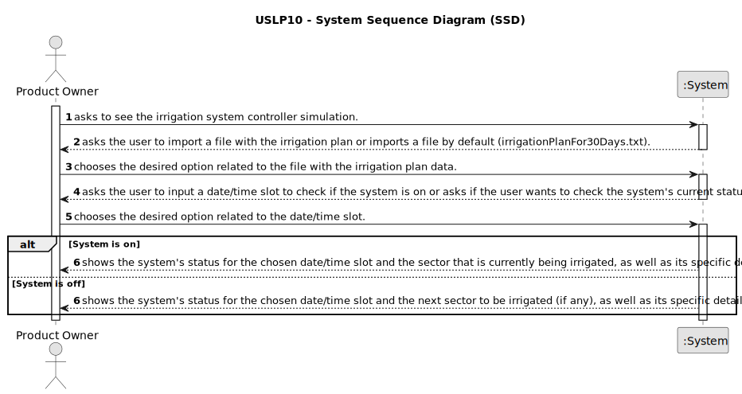

# USLP10 - As Product Owner, I intend to improve the functionality previously developed in USLP02, which consists of simulating an irrigation system controller; the improvement consists of modeling aspects related to fertigation.

## 1. Requirements Engineering

### 1.1. User Story Description

As Product Owner, I intend to improve the functionality previously developed in USLP02, which consists of simulating an irrigation system controller; the improvement consists of modeling aspects related to fertigation.

### 1.2. Customer Specifications and Clarifications

**From the specifications document:**

> A text file with a set of instructions must be consumed, generating an irrigation plan valid for 30 days.
> 
> The file contains the following information and format:
> 
> Irrigation hours: This line defines the times at which an irrigation cycle begins,
for example: 8:30 and 17:00; this means that there are two daily watering cycles that
start at 8:30 and 17:00, respectively.
> 
> Sector, Duration, Regularity: There is a line for each sector to be irrigated. 
Sector (one or more plots) identifies the area to be irrigated (controlled by a
solenoid valve);
Duration, the time in minutes that the sector must receive irrigation;
Regularity, the recurrence formula that defines the days the sector must be
watered: T, all; I, odd, P, even, 3, every 3 days.
> 
> Optionally, the line can contain information about the
fertigation to be carried out, defined by a mix/recipe (composition of production factors) and the recurrence formula for its application (for example, 7 means that it will be applied in the ordinals 1, 8, 15, . . . - first, eighth and fifteenth - of the plan of
fertigation).
> 
> Example:
> 8:30, 17:00
A,14,T,mix1,5
B,8,T
C,25,P,mix2,7
D,25,I
E,7,T,mix1,3
F,10,3
> 
> For capacity reasons, the sectors are watered sequentially.
The need to water on even or odd days results from the need to balance the irrigation needs of
all sectors depending on maximum capacity of the system.
> 
> The irrigation controller contains an irrigation plan for 30 days from the date
of creation and at any time (date/time) knows how to respond whether if it is watering or
not, and, if so, which sector is watering and how many minutes left to finish.

**From the client clarifications:**

> 08/12/2023
> 
> **Question 1:** In the following context of the statement: "Optionally, the line can contain information about the fertigation to be carried out, defined by a mix (composition of production factors, and the recurrence formula for its application, for example 7, meaning that it will be applied in ordinals 1 , 8, 15, . . . (first, eighth and fifteenth) of the fertigation plan",
> I would like to understand exactly what the "ordinals" are, are they the days on which the production factors will be applied?
> 
> **Answer 1:** Exactly. If the ordinal is 2, the fertigation will be applied on the second day of the plan, on the fourth, on the sixth and so on.
Ordinal because it does not have to do with day 2 of the calendar but with the second day of the plan.

> 11/12/2023
> 
> **Question 2:** "A,14,T,mix1,5". Does this mean that watering occurs every day and that fertilization occurs according to the ordinal,
> in this example day 5, 10, 15, etc. after the start of the plan? Or is only fertigation applied in this sector?
> Is the time just for watering or do we also count it for fertigation?
> 
> **Answer 2:** Since fertigation cannot be carried out without irrigation, an error must be generated so that the operator can correct the input file.

> 20/12/2023
> 
> **Question 3:** Suppose the following instruction line "A,10,I,Mix1,2", this instruction states that the fertigation will be applied on the second day of the plan,
> fourth day of the plan, etc. but it also initially says that it only applies to odd-numbered days.
> What should happen if the days that respect the recurrence formula are not Odd days? For example, if the watering plan is created on exactly day 1,
> the ordinals for the recurrence formula "2" will always be even, which would make the instruction incoherent if it initially indicates that it only happens on odd-numbered days.
> 
> **Answer 3:** The question is interesting and complete detection of conflicts between specifications could be complex;
> in the present context, it is enough to present conflicts that arise in a generated plan.

### 1.3. Acceptance Criteria

* **AC1:** The file with the irrigation plan data can't have non-positive duration values.
* **AC2:** The file with the irrigation plan data can't have regularity values different from "T", "P", "I" or "3".
* **AC3:** The second cycle must begin after the first cycle ends (and so on).
* **AC4:** Fertigation can't occur if there is no irrigation (it should be generated an error so the client changes the irrigation plan file).
* **AC5:** The file with the irrigation plan data can't have non-positive fertigation ordinals.

### 1.4. Found out Dependencies

* This US is a development of USLP02, relative to Sprint 1.

### 1.5 Input and Output Data

**Input Data:**

* Typed data:
  * .txt file with the irrigation plan data (if the client wants to).
  * Date/time slot (if the client wants to).

**Output Data:**

* The system's status for the desired date/time slot.

### 1.6. System Sequence Diagram (SSD)

**Other alternatives might exist.**

