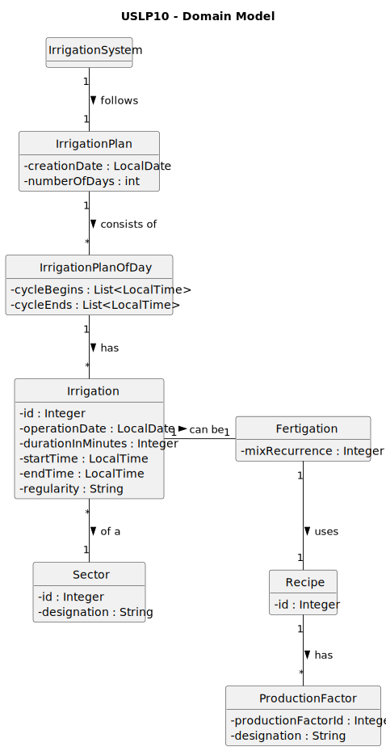

# USLP10 - As Product Owner, I intend to improve the functionality previously developed in USLP02, which consists of simulating an irrigation system controller; the improvement consists of modeling aspects related to fertigation.

## 2. Analysis

### 2.1. Relevant Domain Model Excerpt 

