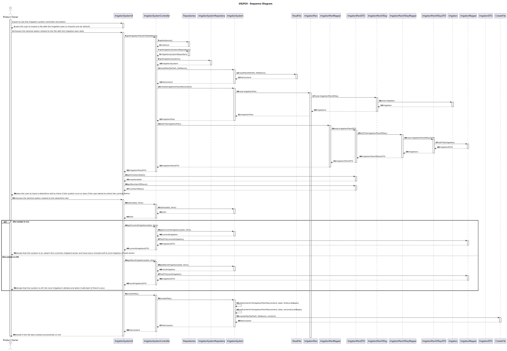
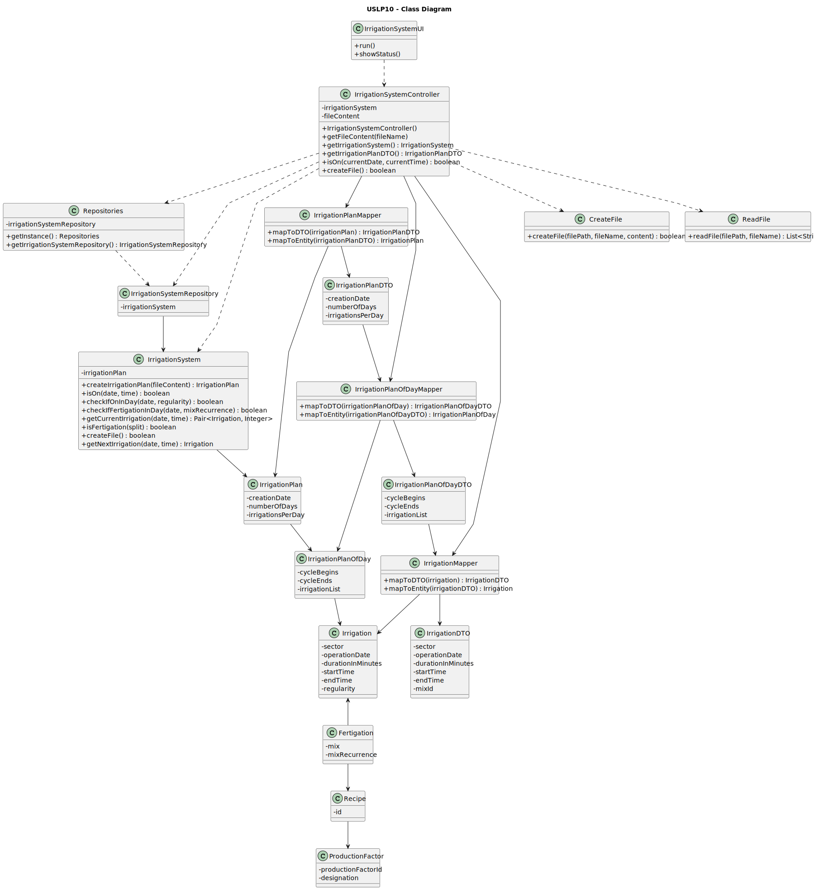

# USLP10 - As Product Owner, I intend to improve the functionality previously developed in USLP02, which consists of simulating an irrigation system controller; the improvement consists of modeling aspects related to fertigation.

## 3. Design - User Story Realization 

### 3.1. Rationale

| Interaction ID                                                                                                                                            | Question: Which class is responsible for...                                                         | Answer                     | Justification (with patterns)                                                                                                                                          |
|:----------------------------------------------------------------------------------------------------------------------------------------------------------|:----------------------------------------------------------------------------------------------------|:---------------------------|:-----------------------------------------------------------------------------------------------------------------------------------------------------------------------|
| Step 1: asks to see the irrigation system controller simulation                                                                                           | ... interacting with the user?                                                                      | IrrigationSystemUI         | Pure Fabrication: there is no reason to assign this responsibility to any existing class in the Domain Model.                                                          |
|                                                                                                                                                           | ... coordinating the US?                                                                            | IrrigationSystemController | Controller: this class is responsible for coordinating and distributing the actions perfomed on the UI to the domain layer.                                            |
| Step 2: asks the user to import a file with the irrigation plan or imports a file by default                                                              | ... interacting with the user?                                                                      | IrrigationSystemUI         | Pure Fabrication: there is no reason to assign this responsibility to any existing class in the Domain Model.                                                          |
| Step 3: chooses the desired option related to the file with the irrigation plan data                                                                      | ... interacting with the user?                                                                      | IrrigationSystemUI         | Pure Fabrication: there is no reason to assign this responsibility to any existing class in the Domain Model.                                                          |
|                                                                                                                                                           | ... asking the system to read the file?                                                             | IrrigationSystemController | Controller: this class is responsible for coordinating and distributing the actions perfomed on the UI to the domain layer.                                            |
|                                                                                                                                                           | ... reading the file and returning its content?                                                     | ReadFile                   | Pure Fabrication: there is no reason to assign this responsibility to any existing class in the Domain Model.                                                          |
| Step 4: asks the user to input a date/time slot to check if the system is on or asks if the user wants to check the system's current status               | ... interacting with the user?                                                                      | IrrigationSystemUI         | Pure Fabrication: there is no reason to assign this responsibility to any existing class in the Domain Model.                                                          |
| Step 5: chooses the desired option related to the date/time slot                                                                                          | ... interacting with the user?                                                                      | IrrigationSystemUI         | Pure Fabrication: there is no reason to assign this responsibility to any existing class in the Domain Model.                                                          |
|                                                                                                                                                           | ... creating the irrigation system repository?                                                      | Repositories               | Information Expert: keeps an instance of IrrigationSystemRepository and knows all its details.                                                                         |
|                                                                                                                                                           | ... creating the irrigation system?                                                                 | IrrigationSystemRepository | Information Expert: keeps an instance of IrrigationSystem and knows all its details.                                                                                   |
|                                                                                                                                                           | ... knowing the current irrigation plan data?                                                       | IrrigationSystem           | Information Expert: keeps an instance of IrrigationPlan and knows all its details.                                                                                     |
|                                                                                                                                                           | ... check if the system is on for the desired date/time slot?                                       | IrrigationSystem           | Information Expert: has its own information.                                                                                                                           |
|                                                                                                                                                           | ... know which sector is being irrigated and how many minutes are there left to finish?             | IrrigationSystem           | Information Expert: keeps an instance of IrrigationPlan and knows all its details.                                                                                     |
|                                                                                                                                                           | ... know the details of the current irrigation/fertigation?                                         | Irrigation/Fertigation     | Information Expert: has its own information.                                                                                                                           |
|                                                                                                                                                           | ... know the details of the used recipe (in case it's a fertigation)?                               | Recipe                     | Information Expert: has its own information.                                                                                                                           |
|                                                                                                                                                           | ... know the details of the production factors of the used recipe (in case it's a fertigation)?     | ProductionFactor           | Information Expert: has its own information.                                                                                                                           |
|                                                                                                                                                           | ... know the details of the current sector being irrigated?                                         | Sector                     | Information Expert: has its own information.                                                                                                                           |
| Step 6 (alt 1): shows the system's status for the chosen date/time slot and the sector that is currently being irrigated, as well as its specific details | ... interacting with the user?                                                                      | IrrigationSystemUI         | Pure Fabrication: there is no reason to assign this responsibility to any existing class in the Domain Model.                                                          |
|                                                                                                                                                           | ... creating the file with the irrigation plan for a certain number of days?                        | CreateFile                 | Pure Fabrication: there is no reason to assign this responsibility to any existing class in the Domain Model.                                                          |
| Step 6 (alt 2): shows the system's status for the chosen date/time slot and the next sector to be irrigated (if any), as well as its specific details     | ... interacting with the user?                                                                      | IrrigationSystemUI         | Pure Fabrication: there is no reason to assign this responsibility to any existing class in the Domain Model.                                                          |
|                                                                                                                                                           | ... creating the file with the irrigation plan for a certain number of days?                        | CreateFile                 | Pure Fabrication: there is no reason to assign this responsibility to any existing class in the Domain Model.                                                          |

### Systematization ##

According to the taken rationale, the conceptual classes promoted to software classes are: 

 * IrrigationSystem
 * IrrigationPlan
 * IrrigationPlanOfDay
 * Irrigation
 * Fertigation
 * Recipe
 * ProductionFactor
 * Sector

Other software classes identified: 

 * IrrigationSystemUI
 * IrrigationSystemController
 * Repositories
 * IrrigationSystemRepository
 * IrrigationPlanDTO
 * IrrigationPlanMapper
 * IrrigationPlanOfDayDTO
 * IrrigationPlanOfDayMapper
 * IrrigationDTO
 * IrrigationMapper
 * ReadFile
 * CreateFile

## 3.2. Sequence Diagram (SD)

This diagram shows the full sequence of interactions between the classes involved in the realization of this user story.

## 3.3. Class Diagram (CD)

