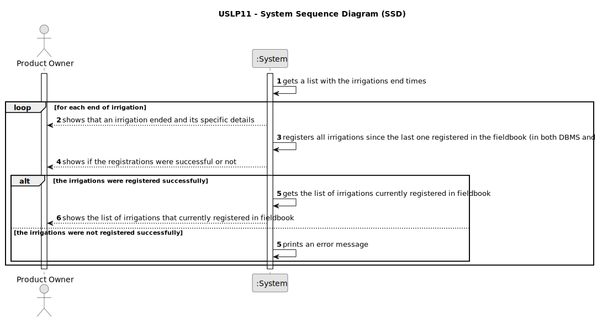

# USLP11 - As Product Owner, I want to improve the functionality developed at USLP03 which, automatically, consumes the irrigation plan generated by the irrigation system simulator developed at USLP10 and which in a staggered manner after completion of irrigation and/or fertilization in each sector, records the operation in the fieldbook

## 1. Requirements Engineering

### 1.1. User Story Description

As Product Owner, I want to improve the functionality developed at USLP03 which, automatically, consumes the irrigation plan generated by the irrigation system simulator developed at USLP10 and which in a staggered manner after completion of irrigation and/or fertilization in each sector, records the operation in the fieldbook.

### 1.2. Customer Specifications and Clarifications

**From the specifications document:**

> In the development of this US, aspects studied in Distributed Systems (such as, for example, fault tolerance) will be intentionally ignored.

### 1.3. Acceptance Criteria

* **AC1:** The system must be able to consume the irrigation plan generated by the irrigation system simulator developed at USLP10.
* **AC2:** The system must be able to record the operation in the fieldbook (in both DBMS and .csv file) in a staggered manner after completion of irrigation and/or fertilization in each sector.

### 1.4. Found out Dependencies

* This US is a development of USLP03, relative to Sprint 2.

### 1.5 Input and Output Data

**Input Data:**

* _NONE_

**Output Data:**

* The finalized irrigation/fertilization operation and its details.
* The fieldbook content (obtained from the DBMS).

### 1.6. System Sequence Diagram (SSD)

**Other alternatives might exist.**

