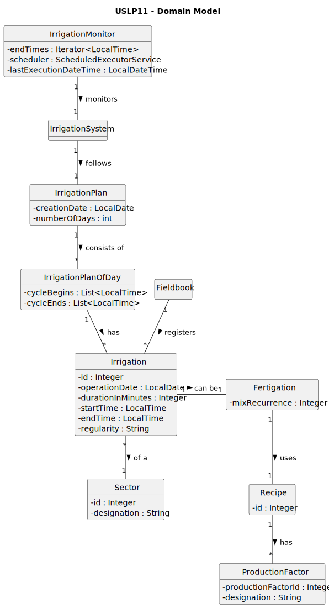

# USLP11 - As Product Owner, I want to improve the functionality developed at USLP03 which, automatically, consumes the irrigation plan generated by the irrigation system simulator developed at USLP10 and which in a staggered manner after completion of irrigation and/or fertilization in each sector, records the operation in the fieldbook

## 2. Analysis

### 2.1. Relevant Domain Model Excerpt 

