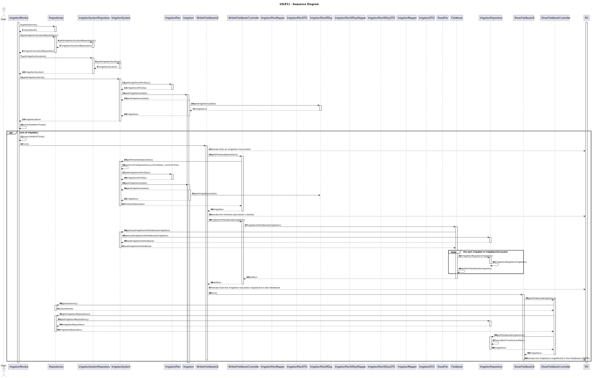
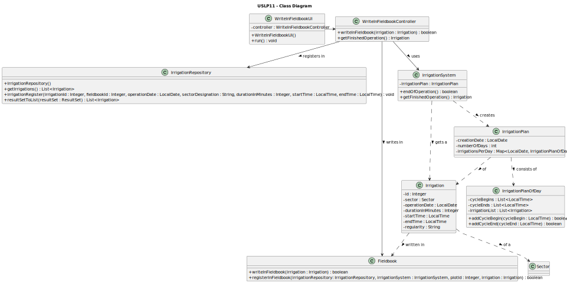

# USLP11 - As Product Owner, I want to improve the functionality developed at USLP03 which, automatically, consumes the irrigation plan generated by the irrigation system simulator developed at USLP10 and which in a staggered manner after completion of irrigation and/or fertilization in each sector, records the operation in the fieldbook

## 3. Design - User Story Realization 

### 3.1. Rationale

| Interaction ID                                                                                                | Question: Which class is responsible for...                              | Answer                     | Justification (with patterns)                                                                                                |
|:--------------------------------------------------------------------------------------------------------------|:-------------------------------------------------------------------------|:---------------------------|:-----------------------------------------------------------------------------------------------------------------------------|
| Step 1: gets a list with the irrigations end times                                                            | ... interacting with the user?                                           | WriteInFieldbookUI         | Pure Fabrication: there is no reason to assign this responsibility to any existing class in the Domain Model.                |
|                                                                                                               | ... coordinating the US?                                                 | WriteInFieldbookController | Controller: this class is responsible for coordinating and distributing the actions perfomed on the UI to the domain layer.  |
|                                                                                                               | ... getting the repository where the irrigation system instance is kept? | Repositories               | Information Expert: keeps an instance of IrrigationSystemRepository and knows all its details.                               |
|                                                                                                               | ... getting the irrigation system instance?                              | IrrigationSystemRepository | Information Expert: keeps an instance of IrrigationSystem and knows all its details.                                         |
|                                                                                                               | ... getting the irrigations end times list?                              | IrrigationSystem           | Information Expert: keeps an instance of IrrigationPlan and knows all its details.                                           |
|                                                                                                               | ... launching the running of the UI?                                     | IrrigationMonitor          | Pure Fabrication: there is no reason to assign this responsibility to any existing class in the Domain Model.                |
| Step 2: shows that an irrigation ended and its specific details                                               | ... interacting with the user?                                           | WriteInFieldbookUI         | Pure Fabrication: there is no reason to assign this responsibility to any existing class in the Domain Model.                |
|                                                                                                               | ... knowing the details of the finalized irrigation/fertigation?         | Irrigation/Fertigation     | Information Expert: has its own information.                                                                                 |
| Step 3: registers all irrigations since the last one registered in the fieldbook (in both DBMS and .csv file) | ... interacting with the user?                                           | WriteInFieldbookUI         | Pure Fabrication: there is no reason to assign this responsibility to any existing class in the Domain Model.                |
|                                                                                                               | ... writing the irrigations in the fieldbook (.csv file)?                | Fieldbook                  | Pure Fabrication: there is no reason to assign this responsibility to any existing class in the Domain Model.                |
|                                                                                                               | ... registering the irrigations in the fieldbook (DBMS)?                 | IrrigationRepository       | Information Expert: responsible for the conneciton between class Irrigation and the DBMS.                                    |
| Step 4: shows if the registrations were successful or not                                                     | ... interacting with the user?                                           | WriteInFieldbookUI         | Pure Fabrication: there is no reason to assign this responsibility to any existing class in the Domain Model.                |
| Step 5 (alt 1): gets the list of irrigations currently registered in fieldbook                                | ... getting the repository where the irrigation system instance is kept? | Repositories               | Information Expert: keeps an instance of IrrigationSystemRepository and knows all its details.                               |
|                                                                                                               | ... getting the irrigation system instance?                              | IrrigationSystemRepository | Information Expert: keeps an instance of IrrigationSystem and knows all its details.                                         |
|                                                                                                               | ... getting the irrigations list?                                        | IrrigationSystem           | Information Expert: keeps an instance of IrrigationPlan and knows all its details.                                           |
| Step 6 (alt 1): shows the list of irrigations that currently registered in fieldbook                          | ... interacting with the user?                                           | ShowFieldbookUI            | Pure Fabrication: there is no reason to assign this responsibility to any existing class in the Domain Model.                |
|                                                                                                               | ... coordinating this part of the US?                                    | ShowFieldbookController    | Controller: this class is responsible for coordinating and distributing the actions perfomed on the UI to the domain layer.  |
|                                                                                                               | ... knowing the details of the irrigations/fertigations to be shown?     | Irrigation/Fertigation     | Information Expert: has its own information.                                                                                 |
| Step 5 (alt 2): prints an error message                                                                       | ... interacting with the user?                                           | WriteInFieldbookUI         | Pure Fabrication: there is no reason to assign this responsibility to any existing class in the Domain Model.                |

Step 5 (alt 1): gets the list of irrigations currently registered in fieldbook
### Systematization ##

According to the taken rationale, the conceptual classes promoted to software classes are: 

 * IrrigationSystem
 * IrrigationPlan
 * IrrigationPlanOfDay
 * Irrigation
 * Fertigation
 * Recipe
 * ProductionFactor
 * Sector

Other software classes identified: 

 * WriteInFieldbookUI
 * WriteInFieldbookController
 * IrrigationMonitor
 * Fieldbook
 * Repositories
 * IrrigationSystemRepository
 * IrrigationRepository
 * IrrigationPlanDTO
 * IrrigationPlanMapper
 * IrrigationPlanOfDayDTO
 * IrrigationPlanOfDayMapper
 * IrrigationDTO
 * IrrigationMapper
 * ShowInFieldbookUI
 * ShowInFieldbookController

## 3.2. Sequence Diagram (SD)

This diagram shows the full sequence of interactions between the classes involved in the realization of this user story.

## 3.3. Class Diagram (CD)

